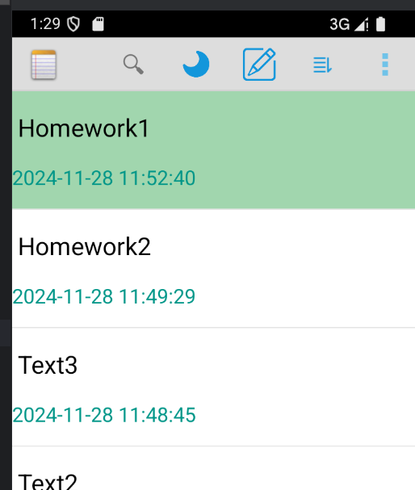
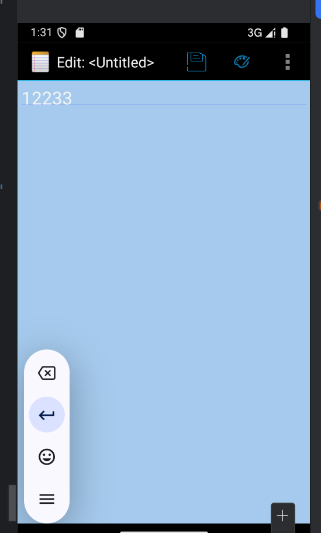

## 配置详情

### 1. `使用JDK9的版本`

### 2. `gradle-wrapper.properties`6.7.1

### 3.  `build.gradle(notepad)`
classpath请使用3.4.0:

# 基本功能1：时间戳


## 1.在 noteslist_item.xml 文件中添加一个 TextView，用于显示时间戳
    <TextView
    android:id="@+id/tv_date"
    android:layout_width="wrap_content"
    android:layout_height="wrap_content"
    android:textSize="18sp"
    android:textColor="#009688"
    android:layout_marginBottom="16dp"
    />

## 2.在 NoteList 中添加修改时间的列，这样可以从数据库中查询到修改时间（时间戳）

      private static final String[] PROJECTION = new String[] {
            NotePad.Notes._ID, // 0
            NotePad.Notes.COLUMN_NAME_TITLE, // 1
            NotePad.Notes.COLUMN_NAME_MODIFICATION_DATE, // 2
    };

## 3.在 onCreate 方法中，初始化需要绑定的视图 ID，包括标题和时间戳 TextView

    int[] viewIDs = {R.id.tv_title,R.id.tv_date};  


## 4.创建格式化时间的方法，使用 SimpleCursorAdapter 和 ViewBinder 来绑定视图数据
``adapter.setViewBinder(new SimpleCursorAdapter.ViewBinder() {
`            @Override
          public boolean setViewValue(View view, Cursor cursor, int columnIndex) {
                if (view.getId() == R.id.tv_date) {

                    long timestamp = cursor.getLong(columnIndex);

                    // 格式化时间
                    SimpleDateFormat sdf = new SimpleDateFormat("yyyy-MM-dd HH:mm:ss", Locale.getDefault());
                    String formattedDate = sdf.format(new Date(timestamp));


                   ((TextView) view).setText(formattedDate);
                   return true;
                }
                 return false;
            }
        });```
# 基本功能2：搜索（通过标题和内容）


## 1.在 list_options_menu.xml 中新增一个菜单项，用于启用搜索功能
    <item
        android:id="@+id/search"
        android:title="@string/search"
        android:icon="@drawable/ic_menu_search"
        android:showAsAction="always"
        android:actionViewClass="android.widget.SearchView" />

## 2.在 onCreateOptionsMenu 方法中，添加一个搜索监听器，处理用户的搜索输入并调用查询方法
onCreateOptionsMenu中

    SearchManager searchManager = (SearchManager) getSystemService(Context.SEARCH_SERVICE);
    SearchView searchView = (SearchView) menu.findItem(R.id.search).getActionView();

        searchView.setSearchableInfo(searchManager.getSearchableInfo(getComponentName()));
        //展开图标
        searchView.setIconifiedByDefault(true);
        //提交时被调用
        searchView.setOnQueryTextListener(new SearchView.OnQueryTextListener() {
            @Override
            public boolean onQueryTextSubmit(String query) {
                return false;
            }

            @Override
            public boolean onQueryTextChange(String newText) {
                //过滤显示的笔记
                displayNotes(newText);
                return true;
            }
        });

## 3.过滤显示笔记的方法，执行数据库查询，筛选符合条件的笔记

    private void displayNotes(String text) {
    // 构造查询条件和查询参数
    String selection = null;
    String[] selectionArgs = null;

        if (!TextUtils.isEmpty(text)) {
            // 按标题和内容进行模糊查询
            selection = NotePad.Notes.COLUMN_NAME_TITLE + " LIKE ? OR " + NotePad.Notes.COLUMN_NAME_NOTE + " LIKE ?";
            selectionArgs = new String[] { "%" + text + "%", "%" + text + "%" };
        }

        // 执行查询
        Cursor cursor = getContentResolver().query(
                NotePad.Notes.CONTENT_URI,        // 使用 NotePad 提供的默认内容 URI
                PROJECTION,                       // 查询的列（ID, 标题，修改时间等）
                selection,                        // 查询条件：如果有搜索文本，就用模糊查询条件
                selectionArgs,                    // 查询条件的参数
                NotePad.Notes.DEFAULT_SORT_ORDER  // 默认按修改时间排序
        );

        // 更新适配器的光标
        MyCursorAdapter adapter = (MyCursorAdapter) getListAdapter();
        if (adapter != null) {
            adapter.changeCursor(cursor); // 更新 ListView 的数据
        }
    }
##  4.在 Provider 中的 query 方法里加上模糊查询，处理内容和标题的匹配
    
    if (!TextUtils.isEmpty(selection)) {
    String queryText = selectionArgs[0]; // 获取用户输入的查询文本
    selection = NotePad.Notes.COLUMN_NAME_TITLE + " LIKE ? OR " + NotePad.Notes.COLUMN_NAME_NOTE + " LIKE ?";
    selectionArgs = new String[] { "%" + queryText + "%", "%" + queryText + "%" };
    }


# 拓展功能1：UI界面美化

## 1.在 styles.xml 中定义溢出菜单的颜色和样式

     <style name="OverflowButtonStyle" parent="@android:style/Widget.Holo.ActionButton.Overflow">
    <!--        <item name="android:src">@drawable/ic_menu_menu</item>  -->
            <!-- 溢出菜单图标颜色-->
            <item name="android:layout_width">4dp</item>  <!-- 设置宽度 -->
            <item name="android:layout_height">4dp</item>  <!-- 设置高度 -->
            <item name="android:tint">@color/colorPrimary</item>  <!-- 设置颜色 -->
        </style>


## 2.定义亮色和暗色主题样式，分别在主题中引用溢出菜单样式

    <style name="light" parent="@android:style/Theme.Holo.Light">
      
        <item name="android:actionOverflowButtonStyle">@style/OverflowButtonStyle</item>
    </style>

    <style name="dark" parent="@android:style/Theme.Holo">
      
        <item name="android:actionOverflowButtonStyle">@style/OverflowButtonStyle</item>
    </style>

## 3.在菜单文件中添加主题切换项
    <item
        android:id="@+id/theme"
        android:title="切换主题"
        android:icon="@drawable/ic_menu_dark"
    android:showAsAction="always"/>

## 4.在OnCreate里设置默认主题等
    int currentTheme = getSharedPreferences("prefs", MODE_PRIVATE)
    .getInt("current_theme", R.style.light); // 默认亮色主题
    setTheme(currentTheme); // 在 setContentView 之前设置主题
    super.onCreate(savedInstanceState);
    
            setContentView(R.layout.noteslist_item);
##  5.在 onCreateOptionsMenu 中设置图标切换，根据当前主题设置不同的图标
    MenuItem themeItem = menu.findItem(R.id.theme);
    // 根据当前主题设置图标
    int currentTheme = getSharedPreferences("prefs", MODE_PRIVATE)
    .getInt("current_theme", R.style.light); // 默认亮色主题

        if (currentTheme == R.style.light) {
            themeItem.setIcon(R.drawable.ic_menu_dark);  // 设置月亮图标（亮色模式）
        } else {
            themeItem.setIcon(R.drawable.ic_menu_light);   // 设置太阳图标（暗色模式）
        }
## 6.onOptionsItemSelected添加点击事件，处理菜单项点击事件，切换主题    

          case R.id.theme:
                
                toggleTheme(item); 
                return true;

         并定义切换的逻辑
    private void toggleTheme(MenuItem item) {
       
        int currentTheme = getSharedPreferences("prefs", MODE_PRIVATE)
                .getInt("current_theme", R.style.light);  // 默认亮色主题

        if (currentTheme == R.style.light) {
            // 切换为暗色主题
            setTheme(R.style.dark);
            item.setIcon(R.drawable.ic_menu_light);  // 设置太阳图标
            getSharedPreferences("prefs", MODE_PRIVATE).edit()
                    .putInt("current_theme", R.style.dark)
                    .apply();
        } else {
            // 切换为亮色主题
            setTheme(R.style.light);
            item.setIcon(R.drawable.ic_menu_dark);  // 设置月亮图标
            getSharedPreferences("prefs", MODE_PRIVATE).edit()
                    .putInt("current_theme", R.style.light)
                    .apply();
        }

        recreate();
    }



# 7添加颜色

在 NotePad 契约类中定义了一个新的字段 COLUMN_NAME_BACK_COLOR，用于存储每个笔记的背景颜色
       
    public static final String COLUMN_NAME_BACK_COLOR = "color";
        
创建数据库表地方添加颜色的字段：

         @Override
    public void onCreate(SQLiteDatabase db) {
        db.execSQL("CREATE TABLE " + NotePad.Notes.TABLE_NAME + "   ("
        + NotePad.Notes._ID + " INTEGER PRIMARY KEY,"
        + NotePad.Notes.COLUMN_NAME_TITLE + " TEXT,"
        + NotePad.Notes.COLUMN_NAME_NOTE + " TEXT,"
        + NotePad.Notes.COLUMN_NAME_CREATE_DATE + " INTEGER,"
        + NotePad.Notes.COLUMN_NAME_MODIFICATION_DATE + " INTEGER,"
        + NotePad.Notes.COLUMN_NAME_BACK_COLOR + " INTEGER" //颜色
        + ");");
       }

把颜色定义为INTEGER
    
    public static final int DEFAULT_COLOR = 0; //白
    public static final int YELLOW_COLOR = 1; //黄
    public static final int BLUE_COLOR = 2; //蓝
    public static final int GREEN_COLOR = 3; //绿
    public static final int RED_COLOR = 4; //红

由于数据库中多了一个字段，所以要在NotePadProvider中添加对其相应的处理，确保插入和查询操作能够正确处理该字段：

static{}中：
    
    sNotesProjectionMap.put(
    NotePad.Notes.COLUMN_NAME_BACK_COLOR,
    NotePad.Notes.COLUMN_NAME_BACK_COLOR);

insert中：
    
    if (values.containsKey(NotePad.Notes.COLUMN_NAME_BACK_COLOR) == false) {
    values.put(NotePad.Notes.COLUMN_NAME_BACK_COLOR, NotePad.Notes.DEFAULT_COLOR);
    }


# 8通过继承 SimpleCursorAdapter 自定义了 MyCursorAdapter，重写了 bindView 方法，根据背景颜色设置每行的背景色，把自定义的格式化方法也移过来了
    
    public class MyCursorAdapter extends SimpleCursorAdapter {


    public MyCursorAdapter(Context context, int layout, Cursor c,
                           String[] from, int[] to) {
        super(context, layout, c, from, to);
    }


    @Override
    public void bindView(View view, Context context, Cursor cursor) {
        super.bindView(view, context, cursor);


        int x = cursor.getInt(cursor.getColumnIndex(NotePad.Notes.COLUMN_NAME_BACK_COLOR));
        switch (x) {
            case NotePad.Notes.DEFAULT_COLOR:
                view.setBackgroundColor(Color.rgb(255, 255, 255));
                break;
            case NotePad.Notes.YELLOW_COLOR:
                view.setBackgroundColor(Color.rgb(247, 216, 133));
                break;
            case NotePad.Notes.BLUE_COLOR:
                view.setBackgroundColor(Color.rgb(165, 202, 237));
                break;
            case NotePad.Notes.GREEN_COLOR:
                view.setBackgroundColor(Color.rgb(161, 214, 174));
                break;
            case NotePad.Notes.RED_COLOR:
                view.setBackgroundColor(Color.rgb(244, 149, 133));
                break;
            default:
                view.setBackgroundColor(Color.rgb(255, 255, 255));
                break;
        }
        // 如果是日期 TextView，格式化时间并设置文本
        TextView dateView = (TextView) view.findViewById(R.id.tv_date);
        if (dateView != null) {
            long timestamp = cursor.getLong(cursor.getColumnIndex(NotePad.Notes.COLUMN_NAME_MODIFICATION_DATE));

            // 格式化时间
            SimpleDateFormat sdf = new SimpleDateFormat("yyyy-MM-dd HH:mm:ss", Locale.getDefault());
            String formattedDate = sdf.format(new Date(timestamp));

            // 设置日期文本
            dateView.setText(formattedDate);
        }
    }
}

# 9 NotesList中的PROJECTION添加颜色项：
    
    private static final String[] PROJECTION = new String[] {
    NotePad.Notes._ID, // 0
    NotePad.Notes.COLUMN_NAME_TITLE, // 1
    //扩展 显示时间 颜色
    NotePad.Notes.COLUMN_NAME_MODIFICATION_DATE, // 2
    NotePad.Notes.COLUMN_NAME_BACK_COLOR,
    };

并且将NotesList中用的SimpleCursorAdapter改使用MyCursorAdapter：
    
    //修改为可以填充颜色的自定义的adapter，自定义的代码在MyCursorAdapter.java中
    adapter = new MyCursorAdapter(
    this,
    R.layout.noteslist_item,
    cursor,
    dataColumns,
    viewIDs
    );

在NoteEditor中的PROJECTION中添加颜色项：
    
    private static final String[] PROJECTION =
    new String[] {
    NotePad.Notes._ID,
    NotePad.Notes.COLUMN_NAME_TITLE,
    NotePad.Notes.COLUMN_NAME_NOTE,
    NotePad.Notes.COLUMN_NAME_BACK_COLOR
    };

onsume中添加，处理颜色显示和保存
   
    switch (colorCode) {
    case NotePad.Notes.DEFAULT_COLOR:
    mText.setBackgroundColor(Color.rgb(255, 255, 255)); // 白色
    break;
    case NotePad.Notes.YELLOW_COLOR:
    mText.setBackgroundColor(Color.rgb(247, 216, 133)); // 黄色
    break;
    case NotePad.Notes.BLUE_COLOR:
    mText.setBackgroundColor(Color.rgb(165, 202, 237)); // 蓝色
    break;
    case NotePad.Notes.GREEN_COLOR:
    mText.setBackgroundColor(Color.rgb(161, 214, 174)); // 绿色
    break;
    case NotePad.Notes.RED_COLOR:
    mText.setBackgroundColor(Color.rgb(244, 149, 133)); // 红色
    break;
    default:
    mText.setBackgroundColor(Color.rgb(255, 255, 255)); // 默认背景色为白色
    break;
    }
    }

# 10.添加了一个菜单项用于更改背景颜色

                <item android:id="@+id/menu_color"
        android:title="@string/menu_color"
        android:icon="@drawable/ic_menu_color"
        android:showAsAction="always"/>

在 onOptionsItemSelected() 中处理该菜单项点击事件，跳转到一个新的 NoteColorActivity，在这个 Activity 中用户可以选择背景颜色：
    
    //换背景颜色选项
    case R.id.menu_color:
    changeColor();
    break;

在NoteEditor中添加函数changeColor()：

    private final void changeColor() {
    Intent intent = new Intent(null,mUri);
    intent.setClass(NoteEditor.this,NoteColor.class);
    NoteEditor.this.startActivity(intent);
    }

## 11新建布局note_color.xml
    
    <?xml version="1.0" encoding="utf-8"?>
    <LinearLayout xmlns:android="http://schemas.android.com/apk/res/android"
    android:orientation="horizontal" android:layout_width="match_parent"
    android:layout_height="match_parent">
    <ImageButton
    android:id="@+id/color_white"
    android:layout_width="0dp"
    android:layout_height="50dp"
    android:layout_weight="1"
    android:background="@color/colorWhite"
    android:onClick="white"/>
    <ImageButton
    android:id="@+id/color_yellow"
    android:layout_width="0dp"
    android:layout_height="50dp"
    android:layout_weight="1"
    android:background="@color/colorYellow"
    android:onClick="yellow"/>
    <ImageButton
    android:id="@+id/color_blue"
    android:layout_width="0dp"
    android:layout_height="50dp"
    android:layout_weight="1"
    android:background="@color/colorBlue"
    android:onClick="blue"/>
    <ImageButton
    android:id="@+id/color_green"
    android:layout_width="0dp"
    android:layout_height="50dp"
    android:layout_weight="1"
    android:background="@color/colorGreen"
    android:onClick="green"/>
    <ImageButton
    android:id="@+id/color_red"
    android:layout_width="0dp"
    android:layout_height="50dp"
    android:layout_weight="1"
    android:background="@color/colorRed"
    android:onClick="red"/>
    </LinearLayout>

创建NoteColorActivity 允许用户选择背景颜色，并通过 ContentResolver.update() 更新背景颜色

    public class NoteColor extends Activity {

    private Cursor mCursor;
    private Uri mUri;
    private int color;

    private static final String[] PROJECTION = new String[] {
            NotePad.Notes._ID,                // 0
            NotePad.Notes.COLUMN_NAME_BACK_COLOR,  // 1
    };

    // 记录背景色的列索引
    private static final int COLUMN_INDEX_BACK_COLOR = 1;

    @Override
    protected void onCreate(Bundle savedInstanceState) {
        super.onCreate(savedInstanceState);
        setContentView(R.layout.note_color);

        mUri = getIntent().getData();  // 获取传入的 URI
        // 使用 ContentResolver.query() 替代过时的 managedQuery()
        mCursor = getContentResolver().query(
                mUri,        // The URI for the note that is to be retrieved.
                PROJECTION,  // The columns to retrieve
                null,         // No selection criteria are used
                null,         // No selection arguments
                null          // No sort order is needed
        );

        if (mCursor != null && mCursor.moveToFirst()) {
            color = mCursor.getInt(COLUMN_INDEX_BACK_COLOR); // 获取当前背景色
        }
    }

    @Override
    protected void onResume() {
        super.onResume();

        if (mCursor != null && mCursor.moveToFirst()) {
            // 获取当前颜色
            color = mCursor.getInt(COLUMN_INDEX_BACK_COLOR);
        }
    }

    @Override
    protected void onPause() {
        super.onPause();

        if (mCursor != null) {
            // 保存更新的背景颜色
            ContentValues values = new ContentValues();
            values.put(NotePad.Notes.COLUMN_NAME_BACK_COLOR, color);
            getContentResolver().update(mUri, values, null, null);
            mCursor.close(); // 关闭 Cursor，释放资源
        }
    }

    public void white(View view) {
        color = NotePad.Notes.DEFAULT_COLOR;
        finish();  // 完成操作后结束 Activity
    }

    public void yellow(View view) {
        color = NotePad.Notes.YELLOW_COLOR;
        finish();  // 完成操作后结束 Activity
    }

    public void blue(View view) {
        color = NotePad.Notes.BLUE_COLOR;
        finish();  // 完成操作后结束 Activity
    }

    public void green(View view) {
        color = NotePad.Notes.GREEN_COLOR;
        finish();  // 完成操作后结束 Activity
    }

    public void red(View view) {
        color = NotePad.Notes.RED_COLOR;
        finish();  // 完成操作后结束 Activity
    }
}

在AndroidManifest.xml中将这个Acitvity主题定义为对话框样式
    
    <!--换背景色-->
    <activity android:name="NoteColor"
    android:theme="@android:style/Theme.Holo.Light.Dialog"
    android:label="ChangeColor"
    android:windowSoftInputMode="stateVisible"/>




# 拓展功能2 排序

## 1在菜单文件list_options_menu.xml中添加：
    
    <item
    android:id="@+id/menu_sort"
    android:title="@string/menu_sort"
    android:icon="@android:drawable/ic_menu_sort_by_size"
    android:showAsAction="always" >
    <menu>
    <item
    android:id="@+id/menu_sort1"
    android:title="@string/menu_sort1"/>
    <item
    android:id="@+id/menu_sort2"
    android:title="@string/menu_sort2"/>
    <item
    android:id="@+id/menu_sort3"
    android:title="@string/menu_sort3"/>
    </menu>
    </item>

## 2 在 NotesList 的 onOptionsItemSelected() 方法中添加排序逻辑：

    case R.id.menu_sort1:
    cursor = managedQuery(
    getIntent().getData(),            
    PROJECTION,                      
    null,                          
    null,                          
    NotePad.Notes._ID
    );
    adapter = new MyCursorAdapter(
    this,
    R.layout.noteslist_item,
    cursor,
    dataColumns,
    viewIDs
    );
    setListAdapter(adapter);
    return true;

    //修改时间排序
    case R.id.menu_sort2:
    cursor = managedQuery(
    getIntent().getData(),          
    PROJECTION,                      
    null,                            
    null,                       
    NotePad.Notes.DEFAULT_SORT_ORDER
    );
    adapter = new MyCursorAdapter(
    this,
    R.layout.noteslist_item,
    cursor,
    dataColumns,
    viewIDs
    );
    setListAdapter(adapter);
    return true;

    //颜色排序
    case R.id.menu_sort3:
    cursor = managedQuery(
    getIntent().getData(),
    PROJECTION,      
    null,       
    null,       
    NotePad.Notes.COLUMN_NAME_BACK_COLOR
    );
    adapter = new MyCursorAdapter(
    this,
    R.layout.noteslist_item,
    cursor,
    dataColumns,
    viewIDs
    );
    setListAdapter(adapter);
    return true;

定义变量 adapter 和 cursor，并指定数据列和视图ID，方便上面使用

    private MyCursorAdapter adapter;
    private Cursor cursor;
    private String[] dataColumns = { NotePad.Notes.COLUMN_NAME_TITLE ,  NotePad.Notes.COLUMN_NAME_MODIFICATION_DATE } ;
    private int[] viewIDs = { R.id.tv_title , R.id.tv_date };

样式


按创建时间排序


修改时间


颜色


# 拓展功能3 分类

# 1.添加分类

在 NotePad 的契约类中，添加分类字段：

`  public static final String COLUMN_NAME_CATEGORY = "category";`

定义分类

    public static final String CATEGORY_STUDY = "study";   // 学习
    public static final String CATEGORY_LIFE = "life";     // 生活
    public static final String CATEGORY_TASK = "task";     // 任务

在provider onCreate 中创建数据库表时，添加分类字段：

    `
    @Override
    public void onCreate(SQLiteDatabase db) {
    db.execSQL("CREATE TABLE " + NotePad.Notes.TABLE_NAME + "   ("
    + NotePad.Notes._ID + " INTEGER PRIMARY KEY,"
      + NotePad.Notes.COLUMN_NAME_TITLE + " TEXT,"
      + NotePad.Notes.COLUMN_NAME_NOTE + " TEXT,"
      + NotePad.Notes.COLUMN_NAME_CREATE_DATE + " INTEGER,"
      + NotePad.Notes.COLUMN_NAME_MODIFICATION_DATE + " INTEGER,"
      + NotePad.Notes.COLUMN_NAME_BACK_COLOR + " INTEGER,"
      + NotePad.Notes.COLUMN_NAME_CATEGORY + " TEXT" // 新增分类字段
      + ");");
      }
      `
# 2 修改插入内容时，包含分类字段

NoteEditor PROJECTION 添加分类

    private static final String[] PROJECTION =
    new String[] {
    NotePad.Notes._ID,
    NotePad.Notes.COLUMN_NAME_TITLE,
    NotePad.Notes.COLUMN_NAME_NOTE,
    NotePad.Notes.COLUMN_NAME_BACK_COLOR,
    NotePad.Notes.COLUMN_NAME_CATEGORY // 添加分类字段
    };

 OnCreate添加下面代码，确保每次插入都包含分类信息，在插入笔记时读取用户选择的分类，并将其存入 ContentValues 中
 
    // 设置默认分类为 "task"
     ContentValues values = new ContentValues();
     values.put(NotePad.Notes.COLUMN_NAME_CATEGORY, NotePad.Notes.CATEGORY_TASK); // 默认分类为任务
    
    // 插入默认分类
    getContentResolver().update(mUri, values, null, null);
                    

# 3添加分类菜单

list_context_menu.xml中添加

    <item android:id="@+id/menu_category_study"
          android:title="@string/menu_category_study"
          android:icon="@drawable/ic_category_study"/>
    <item android:id="@+id/menu_category_life"
          android:title="@string/menu_category_life"
          android:icon="@drawable/ic_category_life"/>
    <item android:id="@+id/menu_category_task"
          android:title="@string/menu_category_task"
          android:icon="@drawable/ic_category_task"/>

在notelist_item.xml 增加分类图标的 ImageView

    <ImageView
    android:id="@+id/iv_category"
    android:layout_width="wrap_content"
    android:layout_height="wrap_content"
    android:layout_alignParentRight="true"
    android:layout_marginRight="10dp"
    android:src="@drawable/ic_category_task" />

Notelist onContextItemSelected 处理分类点击

    long noteId = info.id;

    switch (item.getItemId()) {
    case R.id.menu_category_study:
    updateCategory(noteId, "学习");
    return true;
    case R.id.menu_category_life:
    updateCategory(noteId, "生活");
    return true;
    case R.id.menu_category_task:
    updateCategory(noteId, "任务");
    return true;

 更新笔记分类的方法
    
    // 更新笔记的分类
    private void updateCategory(long noteId, String category) {
    // 准备更新数据
    ContentValues values = new ContentValues();
    values.put(NotePad.Notes.COLUMN_NAME_CATEGORY, category);  // 更新分类字段

    // 执行更新操作
    getContentResolver().update(
            ContentUris.withAppendedId(NotePad.Notes.CONTENT_URI, noteId), 
            values, 
            null, 
            null);

    // 更新完分类后，刷新笔记列表
    refreshNoteList();
    }

刷新列表，更新数据

    private void refreshNoteList() {
    // 重新查询并更新适配器
    Cursor cursor = getContentResolver().query(
    NotePad.Notes.CONTENT_URI,
    null,
    null,
    null,
    null);

    // 假设你在使用 CursorAdapter
    adapter.changeCursor(cursor);
    }

NotePadProvider添加
    
    // 如果值映射中不包含分类，则将其设置为默认分类（任务）。
    if (values.containsKey(NotePad.Notes.COLUMN_NAME_CATEGORY) == false) {
    values.put(NotePad.Notes.COLUMN_NAME_CATEGORY, NotePad.Notes.CATEGORY_TASK);  // 默认分类为 "任务"
    }
# 4 MyCursorAdapter添加分类图标
        // 设置分类图标
        String category = cursor.getString(cursor.getColumnIndex(NotePad.Notes.COLUMN_NAME_CATEGORY));
        ImageView categoryIcon = (ImageView) view.findViewById(R.id.iv_category);  

        if (category != null) {
            switch (category) {
                case "学习":
                    categoryIcon.setImageResource(R.drawable.ic_category_study);  // 替换成你自己的图标资源
                    break;
                case "生活":
                    categoryIcon.setImageResource(R.drawable.ic_category_life);   // 替换成你自己的图标资源
                    break;
                case "任务":
                    categoryIcon.setImageResource(R.drawable.ic_category_task);  // 替换成你自己的图标资源
                    break;
                default:
                    categoryIcon.setImageResource(R.drawable.ic_category_task);  // 默认图标
                    break;
            }
        }

# 5设置排序

在 list_options_menu.xml 中添加分类排序菜单项：

    <item
    android:id="@+id/menu_sort4"
    android:title="@string/menu_sort4"
    android:icon="@android:drawable/ic_menu_sort_by_size"
    android:showAsAction="always" />

 在 NotesList 的 onOptionsItemSelected 中添加排序处理：

     case R.id.menu_sort4:
     cursor = managedQuery(
     getIntent().getData(),
     PROJECTION,
     null,
     null,
     NotePad.Notes.COLUMN_NAME_CATEGORY  // 按分类排序
     );
     adapter = new MyCursorAdapter(
     this,
     R.layout.noteslist_item,
     cursor,
     dataColumns,
     viewIDs
     );
     setListAdapter(adapter);
     return true;


